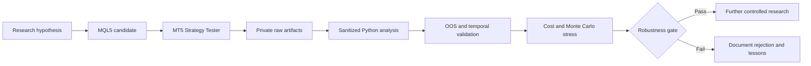

# EA USTEC Lab

Open systematic research on USTEC/Nasdaq CFD using educational MQL5, Python analytics, transparent backtests and long-horizon robustness validation.

EA USTEC Lab turns trading hypotheses into MetaTrader 5 Expert Advisor candidates, Python analysis tools and public research documentation. It studies whether a systematic long-side approach on USTEC/Nasdaq CFD can produce repeatable behavior after cost, drawdown and time-window stress.

The project did find meaningful positive backtest results in 2025. The strongest recent candidate reached +US$ 1,652.00 net profit with PF 1.22 and 8.00% maximum drawdown in that window. The important technical result is that the same family did not survive 5-year and 10-year robustness checks, so no candidate was promoted for operation.

The value of the archive is the method: source review, transparent metrics, rejected hypotheses, robustness gates and a record of what failed. It is published so other developers and researchers can inspect the workflow, reproduce the public summaries where possible, and continue from documented evidence instead of marketing claims.

> Research archive - open for study and continuation.
> No candidate was approved for live, demo, signal or automated operational use.

## Project snapshot

| Area | Current state |
| --- | --- |
| Market | USTEC / Nasdaq CFD |
| Platform | MetaTrader 5 |
| Languages | MQL5 and Python |
| Primary execution context | M5 |
| Research scope | Strategy design, backtesting and robustness |
| Best observed period | 2025 |
| Five-year result | Not robust |
| Ten-year result | Not robust |
| Operational approval | None |
| Public purpose | Education, evidence and continuation |

## Why this project is interesting

This repository connects the full path from strategy idea to rejection-quality evidence. It includes Expert Advisor architecture, systematic entry logic, risk sizing, Strategy Tester workflows, report parsing, spread and ATR instrumentation, trade-level analysis, cost stress, Monte Carlo style thinking, drawdown review, 1-year, 5-year and 10-year comparisons, overfitting control and explicit documentation of failed hypotheses.

The project is useful precisely because it does not stop at the best chart. It keeps the positive 2025 results visible, then puts them next to the longer-horizon failures that changed the decision. Deciding not to promote a system is a technical result when the evidence shows that recent behavior did not generalize.

## Best observed results

| Candidate | Window | Net profit | Profit factor | Maximum drawdown | Trades |
| --- | --- | ---: | ---: | ---: | ---: |
| v0_4_safety | 2025 | +US$ 1,120.04 | 1.13 | 10.23% | 235 |
| session_entry_quality | 2025 | +US$ 1,652.00 | 1.22 | 8.00% | 203 |

These are positive historical Strategy Tester backtest observations in a specific window. They are not live results, signal results, paper trading results, or operational validation.

## Long-horizon reality check

| Candidate | 2025 | 2021-2025 | 2016-2025 | Research decision |
| --- | ---: | ---: | ---: | --- |
| v0_4_safety | +US$ 1,120.04; PF 1.13; DD 10.23% | -US$ 4,801.03; PF 0.83; DD 59.15% | -US$ 6,321.53; PF 0.82; DD 70.12% | Positive in 2025, not robust |
| session_entry_quality | +US$ 1,652.00; PF 1.22; DD 8.00% | -US$ 4,713.09; PF 0.81; DD 60.09% | -US$ 6,086.20; PF 0.81; DD 69.23% | Best recent candidate, not robust |

The recent period was favorable, but the edge did not generalize. Expanding the historical window changed the decision, and no candidate was promoted.

## Experiments and lessons

| Experiment | What looked promising | What failed | Decision |
| --- | --- | --- | --- |
| Regime stand-aside | Reduced exposure | Removed high-quality trades and did not repair Q3 | Rejected |
| Cost/spread gate | Improved selected loss clusters | Damaged OOS quality or trade count | Not supported |
| RR 2.2 / 2.5 / 3.2 | Tested alternative payoff geometry | No variant passed Q2/Q3 gate | Rejected |
| Risk 1% / 5R / 8R | Strong Q2 observation | Q3 failed | Rejected at smoke |
| Risk 2% / 5R / 8R | Large nominal Q2 gain | Q3 equity DD reached 38%-45% | Rejected |
| Session entry quality | Improved 2025 and Q3 | Failed 5- and 10-year robustness | Mixed |

See the full rejection log in [docs/NEGATIVE_RESULTS.md](docs/NEGATIVE_RESULTS.md).

## Research pipeline

## Repository map

| Path | Purpose |
| --- | --- |
| [src/mql5](src/mql5) | Public-review MQL5 research source and exporter files |
| [src/python](src/python) | Python tooling area for public-safe research utilities |
| [docs/RESULTS.md](docs/RESULTS.md) | Public result table and robustness summary |
| [docs/NEGATIVE_RESULTS.md](docs/NEGATIVE_RESULTS.md) | Rejected hypotheses and lessons |
| [docs/RESEARCH_METHOD.md](docs/RESEARCH_METHOD.md) | Research method and validation approach |
| [docs/NEXT_RESEARCH_DIRECTIONS.md](docs/NEXT_RESEARCH_DIRECTIONS.md) | Suggested continuation path |
| [docs/PORTFOLIO_RESEARCH_OVERVIEW.md](docs/PORTFOLIO_RESEARCH_OVERVIEW.md) | Portfolio-style technical overview |
| [scripts/publication_guard.py](scripts/publication_guard.py) | Public repository guard |
| [tests](tests) | Guard tests using synthetic fixtures |

## How to continue the research

Good next work should start from the failure mode, not from the best 2025 number:

1. Define a regime-first hypothesis before changing entry timing.
2. Test fewer, higher-quality trades instead of adding filters after losses.
3. Keep 2025, 2021-2025 and 2016-2025 comparisons visible together.
4. Preserve cost, spread and drawdown stress before any promotion decision.
5. Document rejected variants with the same care as positive variants.

## Public-use boundaries

- Educational research archive only.
- No financial advice, trading advice, signal service or managed-account claim.
- No candidate is approved for live, demo, paper, signal or automated operational use.
- Historical backtests can change with broker, spread, commission, slippage, session, contract specification and data source.
- Initial deposit is not included in the sanitized public summary, so net profit and drawdown should not be treated as transferable account expectations.
