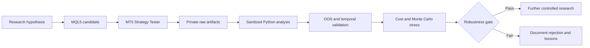

# EA USTEC Lab

[](https://github.com/RicardoBarato/ea-ustec-lab/actions/workflows/ci.yml)


Open systematic research on USTEC/Nasdaq CFD using educational MQL5, Python analytics, transparent backtests and long-horizon robustness validation.

EA USTEC Lab turns trading hypotheses into MetaTrader 5 Expert Advisor candidates, Python analysis tooling and public research documentation. It studies whether a systematic long-side USTEC/Nasdaq CFD method can survive cost, drawdown, temporal and robustness pressure after a promising recent window.

The project found expressive positive historical backtest results in 2025. The best recent candidate, `session_entry_quality`, reached +US$ 1,652.00 net profit, PF 1.22, 8.00% maximum drawdown and 203 trades in that window. The same research family did not survive 5-year and 10-year validation, which changed the decision from promising to not robust.

The value of the archive is the engineering method: MQL5 source, Python tooling, transparent public summaries, evidence boundaries, rejected hypotheses and negative results kept beside the positive observations. The repository is public so other developers and researchers can study the process and continue from documented evidence instead of claims.

> Research archive - open for study and continuation.
>
> No candidate was approved for live, demo, signal or automated operational use.

## Project snapshot

| Area | Current state |
| --- | --- |
| Market | USTEC / Nasdaq CFD |
| Platform | MetaTrader 5 |
| Languages | MQL5 and Python |
| Primary execution context | M5 |
| Research scope | Strategy design, backtesting and robustness |
| Best observed period | 2025 |
| Five-year result | Not robust |
| Ten-year result | Not robust |
| Operational approval | None |
| Public purpose | Education, evidence and continuation |

## Why this project is interesting

This project connects strategy engineering with evidence discipline. It includes Expert Advisor architecture, systematic strategy design, risk sizing, Strategy Tester use, report extraction and parsing, spread and ATR instrumentation, trade-level analysis, cost stress, Monte Carlo thinking, drawdown analysis, 1-year, 5-year and 10-year comparison, overfitting control and documentation of rejected hypotheses.

The repository is useful because it does not stop at the best window. The positive 2025 result remains visible, but the longer historical tests also remain visible and changed the decision. Deciding not to promote a system is a technical result when the data shows that recent behavior did not generalize.

## Best observed results

| Candidate | Window | Net profit | Profit factor | Maximum drawdown | Trades |
| --- | --- | ---: | ---: | ---: | ---: |
| v0_4_safety | 2025 | +US$ 1,120.04 | 1.13 | 10.23% | 235 |
| session_entry_quality | 2025 | +US$ 1,652.00 | 1.22 | 8.00% | 203 |

These were positive historical Strategy Tester backtest results in a specific window, not live, demo, signal, paper-trading or operational validation.

## Long-horizon reality check

| Candidate | 2025 | 2021-2025 | 2016-2025 | Research decision |
| --- | ---: | ---: | ---: | --- |
| v0_4_safety | +US$ 1,120.04; PF 1.13; DD 10.23% | -US$ 4,801.03; PF 0.83; DD 59.15% | -US$ 6,321.53; PF 0.82; DD 70.12% | Positive in 2025, not robust |
| session_entry_quality | +US$ 1,652.00; PF 1.22; DD 8.00% | -US$ 4,713.09; PF 0.81; DD 60.09% | -US$ 6,086.20; PF 0.81; DD 69.23% | Best recent candidate, not robust |

The recent period was favorable, but the edge did not generalize. Expanding the historical sample changed the decision, and no candidate was promoted.

## Experiments and lessons

| Experiment | What looked promising | What failed | Decision |
| --- | --- | --- | --- |
| Regime stand-aside | Reduced exposure | Removed high-quality trades and did not repair Q3 | Rejected |
| Cost/spread gate | Improved selected loss clusters | Damaged OOS quality or trade count | Not supported |
| RR 2.2 / 2.5 / 3.2 | Tested alternative payoff geometry | No variant passed Q2/Q3 gate | Rejected |
| Risk 1% / 5R / 8R | Strong Q2 observation | Q3 failed | Rejected at smoke |
| Risk 2% / 5R / 8R | Large nominal Q2 gain | Q3 equity DD reached 38%-45% | Rejected |
| Session entry quality | Improved 2025 and Q3 | Failed 5- and 10-year robustness | Mixed |

See [docs/NEGATIVE_RESULTS.md](docs/NEGATIVE_RESULTS.md).

## Research pipeline



## Technical architecture

| Layer | Role |
| --- | --- |
| MQL5 strategy layer | Public-review Expert Advisor and exporter source under [src/mql5](src/mql5). |
| Risk and position sizing | Educational sizing logic and drawdown-aware interpretation, not operational approval. |
| MT5 testing boundary | Strategy Tester is used as historical research evidence, not as live performance proof. |
| Private artifact boundary | Raw broker/tester artifacts are excluded from the public repository. |
| Python analytics | Public-safe scripts and tests support validation, guardrails and future data tooling. |
| Public evidence layer | Sanitized result summaries, negative results and continuation notes. |
| CI and publication guard | GitHub Actions and guard tests check public repository hygiene. |

## Repository map

```text
.
|-- src/
|   |-- mql5/
|   `-- python/
|-- tests/
|-- examples/
|   `-- synthetic_data/
|-- scripts/
|-- docs/
`-- .github/workflows/
```

- `src/mql5/` contains the public-review MQL5 research source and exporter.
- `src/python/` reserves space for public-safe Python research tooling.
- `tests/` contains guard tests built from synthetic fixtures.
- `examples/synthetic_data/` contains examples that do not represent real broker data.
- `scripts/` contains the publication guard.
- `docs/` contains results, limitations, method notes and continuation guidance.
- `.github/workflows/` runs public candidate CI.

## Quick start

```bash
git clone https://github.com/RicardoBarato/ea-ustec-lab.git
cd ea-ustec-lab
python -m venv .venv
python -m pip install --upgrade pip
python -m compileall scripts tests
python -m unittest discover -s tests
python scripts/publication_guard.py .
python -c "import pathlib; [print(p) for p in pathlib.Path('examples/synthetic_data').rglob('*') if p.is_file()]"
```

Useful entry points:

- MQL5 source: [src/mql5](src/mql5)
- Python tooling area: [src/python](src/python)
- Synthetic examples: [examples/synthetic_data](examples/synthetic_data)
- Public result summary: [docs/RESULTS.md](docs/RESULTS.md)

No third-party package install is required for the current public guard tests. Do not treat this quick start as an instruction to trade live. It is for repository review, tests, synthetic-example inspection and research continuation.

## Reproducing the research

Market data and raw tester reports are not included. Results depend on broker symbol mapping, spread, commission, slippage, session, contract specification and historical data source. A reproduction should define the instrument, timeframe, data source, test period, execution assumptions and validation gates before comparing PF, DD or net profit.

Use your own data only with a documented data contract. Validate timestamp order, missing bars, duplicate bars, timezone handling, spread assumptions and train/test separation. Avoid lookahead by ensuring every feature or rule uses only information available at the decision time.

Interpret net profit, PF and drawdown together. A positive net value in one year is not enough if the 5-year and 10-year windows fail. Raw reports remain outside the public repository because they can contain machine-specific file locations, broker-specific files or other artifacts that are not safe for a public archive.

See [docs/REPRODUCIBILITY.md](docs/REPRODUCIBILITY.md).

## Engineering and portfolio value

The project demonstrates:

- MQL5 Expert Advisor structure.
- MetaTrader 5 research automation boundaries.
- Python data tooling and guard tests.
- GitHub Actions validation.
- Secure public/private separation.
- Experiment design and rejection discipline.
- Backtest governance and evidence indexing.
- Monte Carlo and cost-stress thinking.
- Risk and drawdown analysis.
- Evidence-based engineering decisions.

## Included in this archive

- Public-review MQL5 research source.
- Public-safe Python guard tooling.
- Synthetic examples.
- Backtest result summaries.
- Negative-result documentation.
- Reproducibility and limitation notes.
- Publication hygiene checks.

## Deliberately not included

- Raw broker data.
- Raw Strategy Tester artifacts.
- Account, credential, server or statement material.
- Presets or tester configuration files.
- Live, demo, paper or signal results.
- Operational approval.
- Unsupported performance claims.

## Where the research can go next

1. New entry thesis.
2. Regime-first architecture.
3. Explicit no-trade logic.
4. Lower-frequency setups.
5. Walk-forward testing.
6. Multi-broker reproduction.
7. Transaction-cost modeling.
8. Multi-year validation from day one.
9. Stronger Monte Carlo acceptance rules.

## Continue the research

Useful contributions include reproductions, tests on other broker data, methodology corrections, new data contracts, robustness tests, documentation improvements and analysis of negative results. Positive and negative results should be documented together.

## Supporting documents

- [Portfolio overview](docs/PORTFOLIO_OVERVIEW.md)
- [Research timeline](docs/RESEARCH_TIMELINE.md)
- [Lessons learned](docs/LESSONS_LEARNED.md)
- [Results interpretation](docs/RESULTS_INTERPRETATION.md)
- [Continuation guide](docs/CONTINUATION_GUIDE.md)
- [Public archive release notes](docs/PUBLIC_ARCHIVE_RELEASE_NOTES.md)

## Disclaimer

This repository is educational research material only. It is not financial advice, trading advice, investment advice, a signal service, live performance evidence or a promise of returns. No system in this archive is approved for operational use.
