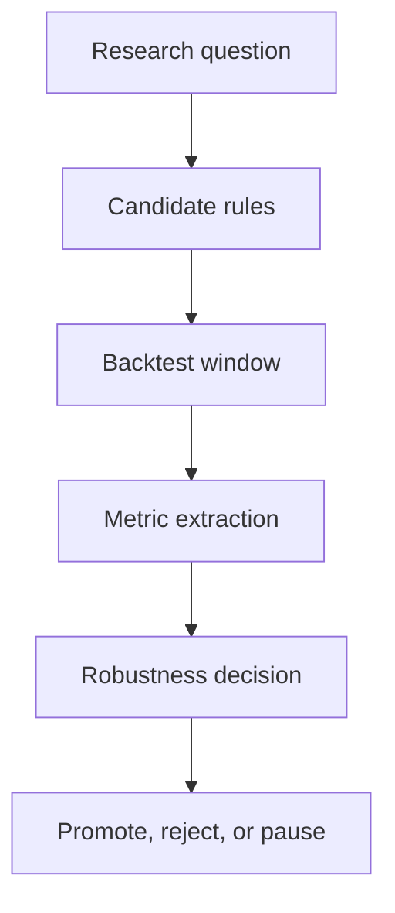

# Architecture

```mermaid
flowchart TD
  A[Research question] --> B[Candidate rules]
  B --> C[Backtest window]
  C --> D[Metric extraction]
  D --> E[Robustness decision]
  E --> F[Promote, reject, or pause]
```
